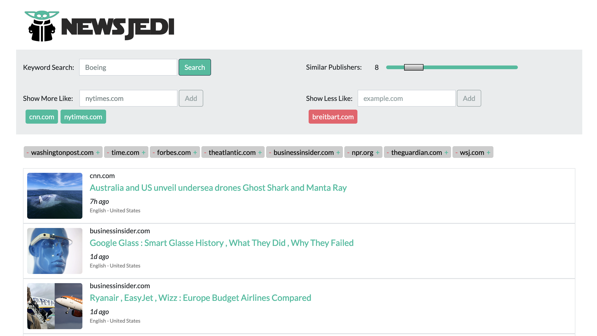
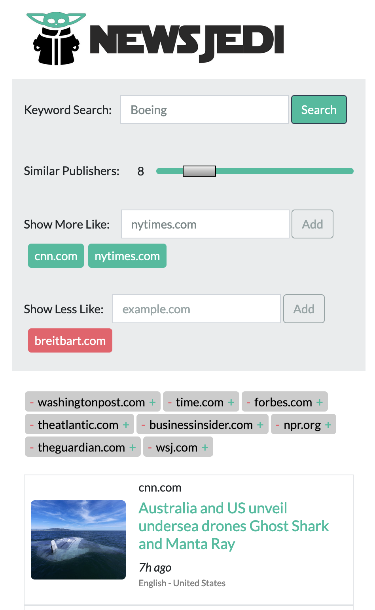

# [NewsJedi](https://newsjedi.online)

Currently live [here](https://newsjedi.online)


NewsJedi is a powerful NewsReader App designed to help you easily curate content across a vast landscape of over 11,000 publishers using a machine learning algorithm to find similar publishers.

## Features
  - ML powered publisher filtering.
  - Responsive design using Bootstrap and jQuery.
  - Uses live news data powered by Gdelt covering over 11,000 publishers.

### Available at
You can access the NewsJedi app at: [newsjedi.online](https://newsjedi.online)

### Screenshots

**Desktop View**



**Mobile View**



## Technology Stack

| Component              | Technology                               |
|------------------------|------------------------------------------|
| Frontend               | HTML, CSS, JavaScript, Bootstrap, jQuery |
| Backend                | Python, Gensim, Flask                    |
| Hosting                | Firebase, Google Cloud Run               |
| Database               | Gensim KeyedVectors                      |
| Live News Data         | Gdelt API                                |
| Security & Performance | Cloudflare (DDoS protection, CDN)        |

## Getting Started

To run this project locally, follow these steps:

1. Clone the repository:
   ```sh
   git clone https://github.com/your-username/newsjedi.git
   cd newsjedi
   ```

2. Set up a virtual environment and install dependencies:
   ```sh
   python3 -m venv venv
   source venv/bin/activate
   pip install -r requirements.txt
   ```

3. Run the application:
   ```sh
   python app.py
   ```

## How It Works

NewsJedi leverages machine learning algorithms to identify and suggest similar news publishers, enabling you to filter, curate, and understand the media landscape effortlessly. The publisher similarities are learned by using a network embedding algorithm trained on a vast dataset, composed of hyperlinks between domains on the internet.

## Contributing

Contributions are welcome! Please open an issue or submit a pull request for any improvements or features you’d like to see.